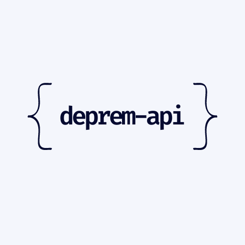
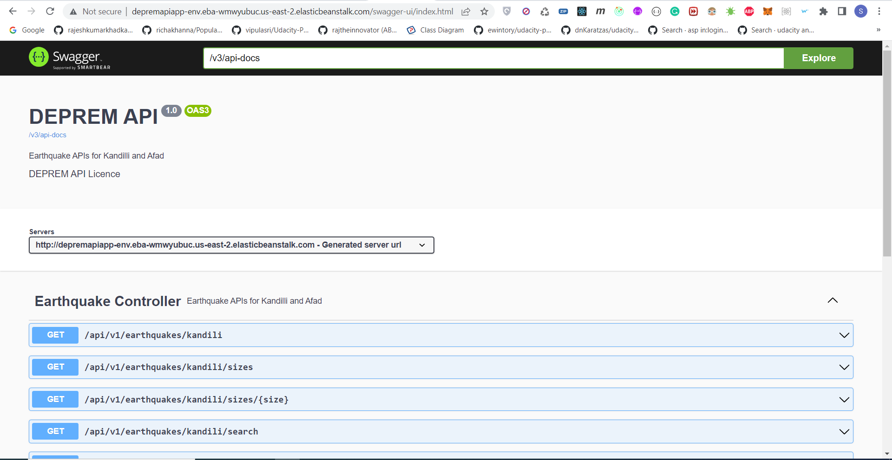

# Deprem Api (Kandilli & Afad)

<p align="center">
    
</p>

### 📖 Information

<ul style="list-style-type:disc">
  <li>The purpose of the project is to get all data from Kandilli and AFAD and analyze them</li>  
  <li>Here is the explanation of the project
      <ul>
        <li>After <b>7.8-magnitude earthquake</b> and <b>7.8-magnitude earthquake</b> occured in <b>Turkey</b> on <b>6th February 2023</b> and I felt very sad about the devastating disaster, I tried to implement an example of getting all earthquakes data from <b>Kandili</b> and <b>Afad</b></li>
        <li>Analyze the data to get specific information by filter through <b>Java Stream API</b></li>
      </ul>
  </li>
</ul>

### 🔨 Run the App

#### Maven

<b>1 )</b> Download your project from this link `https://github.com/Rapter1990/DepremApi`

<b>2 )</b> Go to the project's home directory :  `cd DepremApi`

<b>3 )</b> Create a jar file though this command `mvn clean install`

<b>4 )</b> Run the project though this command `mvn spring-boot:run`

#### AWS 

<b>1 )</b> Create an <b>Environment</b> in <b>AWS Console</b> with defining app's name and uploading its jar file 

<b>2 )</b> Go to <b>Configuration</b> and Select <b>Software</b> Section and Define <b>SERVER_PORT</b> as its port number <b>5000</b> 


### Explore Rest APIs
<table style="width:100%">
  <tr>
    <th>Method</th>
    <th>Url</th>
    <th>Description</th>
    <th>Local</th>
    <th>AWS</th>
  </tr>
  <tr>
    <td>GET</td>
    <td>/api/v1/earthquakes/kandili</td>
    <td>Get All earthquakes list from Kandilli</td>
    <td><a href="README.md#earthquakes_kandili">Info</a></td>
    <td><a href="README.md#earthquakes_kandili_aws">Info</a></td>
  </tr>
  <tr>
      <td>GET</td>
      <td>/api/v1/earthquakes/afad</td>
      <td> Get All earthquakes list from Afad</td>
      <td><a href="README.md#earthquakes_afad">Info</a></td>
      <td><a href="README.md#earthquakes_afad_aws">Info</a></td>
  </tr>
  <tr>
      <td>GET</td>
      <td>/api/v1/earthquakes/kandili/locations/{city_name}</td>
      <td> Get All earthquakes list from Afad</td>
      <td><a href="README.md#earthquakes_kandili_locations">Info</a></td>
      <td><a href="README.md#earthquakes_kandili_locations_aws">Info</a></td>
  </tr>
  <tr>
      <td>GET</td>
      <td>/api/v1/earthquakes/afad/locations/{city_name}</td>
      <td>Filter By Location For Afad</td>
      <td><a href="README.md#earthquakes_afad_locations">Info</a></td>
      <td><a href="README.md#earthquakes_afad_locations_aws">Info</a></td>
  </tr>
  <tr>
      <td>GET</td>
      <td>/api/v1/earthquakes/kandili/sizes/{size_value}</td>
      <td> Filter By Size ML For Kandilli </td>
      <td><a href="README.md#earthquakes_afad_sizes">Info</a></td>
      <td><a href="README.md#earthquakes_afad_sizes_aws">Info</a></td>
  </tr>
  <tr>
      <td>GET</td>
      <td>/api/v1/earthquakes/afad/sizes/{size_value}</td>
      <td>Filter By Location For Afad</td>
      <td><a href="README.md#earthquakes_afad_sizes">Info</a></td>
      <td><a href="README.md#earthquakes_afad_sizes_aws">Info</a></td>
  </tr>
  <tr>
      <td>GET</td>
      <td>/api/v1/earthquakes/kandili/search?location={city_name}&size={size_value}</td>
      <td>Filter By Location And Size For Kandilli</td>
      <td><a href="README.md#earthquakes_kandilli_search">Info</a></td>
      <td><a href="README.md#earthquakes_kandilli_search_aws">Info</a></td>
  </tr>
  <tr>
      <td>GET</td>
      <td>/api/v1/earthquakes/afad/search?location={city_name}&size={size_value}</td>
      <td>Filter By Location And Size For Afad</td>
      <td><a href="README.md#earthquakes_afad_search">Info</a></td>
      <td><a href="README.md#earthquakes_afad_search_aws">Info</a></td>
  </tr>
  <tr>
      <td>GET</td>
      <td>/api/v1/earthquakes/kandili/sizes?minml={minml_value}&maxml={maxml_value}</td>
      <td>Filter By Size Between Two ML For Kandili</td>
      <td><a href="README.md#earthquakes_kandili_sizes">Info</a></td>
      <td><a href="README.md#earthquakes_kandili_sizes_aws">Info</a></td>
  </tr>
  <tr>
      <td>GET</td>
      <td>/api/v1/earthquakes/afad/sizes?minml={minml_value}&maxml={maxml_value}</td>
      <td>Filter By Size Between Two ML For Afad</td>
      <td><a href="README.md#earthquakes_afad_sizes">Info</a></td>
      <td><a href="README.md#earthquakes_afad_sizes_aws">Info</a></td>
  </tr>
</table>

### Used Dependencies
* Spring Boot Web
* Java Stream API
* JUnit
* Jsoup
* Log4j2
* Lombok
* Swagger
* AWS Elastic Beanstalk


### Endpoints Information

##### <a id="earthquakes_kandili"></a>  Get All earthquakes list from Kandilli
``` 
    http://localhost:8080/api/v1/earthquakes/kandili 
```

##### <a id="earthquakes_afad"></a> Get All earthquakes list from Afad
``` 
    http://localhost:8080/api/v1/earthquakes/afad 
```

##### <a id="earthquakes_kandili_locations"></a> Filter By Location For Kandilli
```
   http://localhost:8080/api/v1/earthquakes/kandili/locations/{city_name} 
   
   http://localhost:8080/api/v1/earthquakes/kandili/locations/malatya
```

##### <a id="earthquakes_afad_locations"></a> Filter By Location For Afad
```
   http://localhost:8080/api/v1/earthquakes/afad/locations/{city_name}
   
   http://localhost:8080/api/v1/earthquakes/afad/locations/malatya
```

##### <a id="earthquakes_kandili_sizes"></a> Filter By Size ML For Kandilli
```
   http://localhost:8080/api/v1/earthquakes/kandili/sizes/{size_value}
   
   http://localhost:8080/api/v1/earthquakes/kandili/sizes/3.2
```

##### <a id="earthquakes_afad_sizes"></a> Filter By Size ML For Afad
```
   http://localhost:8080/api/v1/earthquakes/afad/sizes/{size_value}
   
   http://localhost:8080/api/v1/earthquakes/afad/sizes/3.2
```

##### <a id="earthquakes_kandilli_search"></a> Filter By Location And Size For Kandilli
```
   http://localhost:8080/api/v1/earthquakes/kandili/search?location={city_name}&size={size_value}
   
   http://localhost:8080/api/v1/earthquakes/kandili/search?location=malatya&size=3.2
```

##### <a id="earthquakes_afad_search"></a> Filter By Location And Size For Afad
```
   http://localhost:8080/api/v1/earthquakes/afad/search?location={city_name}&size={size_value}
   
   http://localhost:8080/api/v1/earthquakes/afad/search?location=malatya&size=3.2
```

##### <a id="earthquakes_kandili_sizes"></a> Filter By Size Between Two ML For Kandili
```
   http://localhost:8080/api/v1/earthquakes/kandili/sizes?minml={minml_value}&maxml={maxml_value}
   
   http://localhost:8080/api/v1/earthquakes/kandili/sizes?minml=1.1&maxml=4.4
```

##### <a id="earthquakes_afad_sizes"></a> Filter By Size Between Two ML For Afad
```
   http://localhost:8080/api/v1/earthquakes/afad/sizes?minml={minml_value}&maxml={maxml_value}
   
   http://localhost:8080/api/v1/earthquakes/afad/sizes?minml=1.1&maxml=4.4
```

##### <a id="earthquakes_kandili_aws">Get All earthquakes list from Kandilli
``` 
    http://depremapiapp-env.eba-wmwyubuc.us-east-2.elasticbeanstalk.com/api/v1/earthquakes/kandili 
```

##### <a id="earthquakes_afad_aws"></a>Get All earthquakes list from Afad 
``` 
    http://depremapiapp-env.eba-wmwyubuc.us-east-2.elasticbeanstalk.com/api/v1/earthquakes/afad
```

##### <a id="earthquakes_kandili_locations_aws"></a> Filter By Location For Kandilli
``` 
    http://depremapiapp-env.eba-wmwyubuc.us-east-2.elasticbeanstalk.com/api/v1/earthquakes/kandili/locations/{city_name}
    
    http://depremapiapp-env.eba-wmwyubuc.us-east-2.elasticbeanstalk.com/api/v1/earthquakes/kandili/locations/malatya
```

##### <a id="earthquakes_afad_locations_aws"></a> Filter By Location For Afad
```
   http://depremapiapp-env.eba-wmwyubuc.us-east-2.elasticbeanstalk.com/api/v1/earthquakes/afad/locations/{city_name} 

   http://depremapiapp-env.eba-wmwyubuc.us-east-2.elasticbeanstalk.com/api/v1/earthquakes/afad/locations/malatya
```

##### <a id="earthquakes_kandili_sizes_aws"></a> Filter By Size ML For Kandilli
```
   http://depremapiapp-env.eba-wmwyubuc.us-east-2.elasticbeanstalk.com/api/v1/earthquakes/kandili/sizes/{size_value}

   http://depremapiapp-env.eba-wmwyubuc.us-east-2.elasticbeanstalk.com/api/v1/earthquakes/kandili/sizes/3.2
```

##### <a id="earthquakes_afad_sizes_aws"></a> Filter By Size ML For Afad
```
   http://depremapiapp-env.eba-wmwyubuc.us-east-2.elasticbeanstalk.com/api/v1/earthquakes/afad/sizes/{size_value}

   http://depremapiapp-env.eba-wmwyubuc.us-east-2.elasticbeanstalk.com/api/v1/earthquakes/afad/sizes/3.2
```

##### <a id="earthquakes_kandilli_search_aws"></a> Filter By Location And Size For Kandilli
```
   http://depremapiapp-env.eba-wmwyubuc.us-east-2.elasticbeanstalk.com/api/v1/earthquakes/kandili/search?location={city_name}&size={size_value}

   http://depremapiapp-env.eba-wmwyubuc.us-east-2.elasticbeanstalk.com/api/v1/earthquakes/kandili/search?location=malatya&size=3.2
```

##### <a id="earthquakes_afad_search_aws"></a> Filter By Location And Size For Afad
```
   http://depremapiapp-env.eba-wmwyubuc.us-east-2.elasticbeanstalk.com/api/v1/earthquakes/afad/sizes/{size_value}

   http://depremapiapp-env.eba-wmwyubuc.us-east-2.elasticbeanstalk.com/api/v1/earthquakes/afad/search?location=malatya&size=3.2
```

##### <a id="earthquakes_kandili_sizes_aws"></a> Filter By Size Between Two ML For Kandili
```
   http://depremapiapp-env.eba-wmwyubuc.us-east-2.elasticbeanstalk.com/api/v1/earthquakes/kandili/sizes?minml={minml_value}&maxml={maxml_value}

   http://depremapiapp-env.eba-wmwyubuc.us-east-2.elasticbeanstalk.com/api/v1/earthquakes/kandili/sizes?minml=1.1&maxml=4.4
```

##### <a id="earthquakes_afad_sizes_aws"></a> Filter By Size Between Two ML For Afad
```
   http://depremapiapp-env.eba-wmwyubuc.us-east-2.elasticbeanstalk.com/api/v1/earthquakes/afad/sizes?minml={minml_value}&maxml={maxml_value}

   http://depremapiapp-env.eba-wmwyubuc.us-east-2.elasticbeanstalk.com/api/v1/earthquakes/afad/sizes?minml=1.1&maxml=4.4
```

##### Swagger
```
    http://depremapiapp-env.eba-wmwyubuc.us-east-2.elasticbeanstalk.com/swagger-ui/index.html
```

### Screenshots

<details>
<summary>Click here to show the screenshots of project</summary>
    <p> Figure 1 </p>
    
</details>